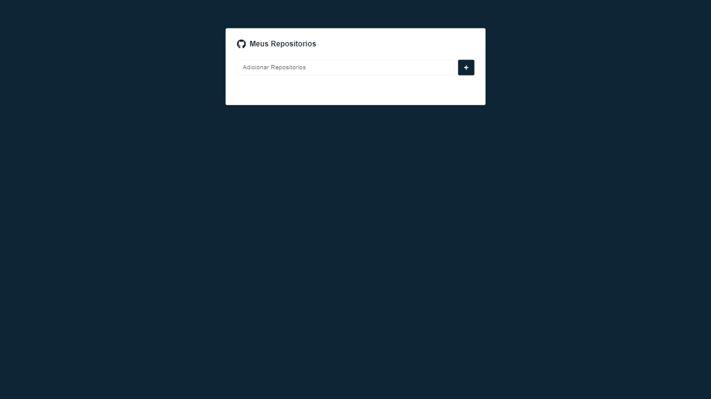

# Coleção de Repositórios Favoritos ⌨️

Este projeto em React foi desenvolvido para permitir aos usuários a possibilidade de favoritar repositórios do GitHub em uma aplicação moderna e responsiva. Além das funcionalidades de filtros e paginações, a aplicação permite também a exclusão de repositórios, conforme necessário, e garante que os repositórios favoritos permaneçam salvos mesmo após a atualização da página.

## Layout desktop 🖥️   
 

 
 
 

## Layout Mobile 📱    

 

 
 
 

## Tecnologias utilizadas 🛜

  

## O que eu aprendi 🤓
Neste projeto pude apronfundar meus conhecimentos em React , utilizando pela primeira vez o styled-components. Pude praticar requisições HTTP assíncronas com Axios para obter dados da API do GitHub e implementar a funcionalidade de favoritar itens, o que envolveu o gerenciamento de estado e a interação entre componentes. 

Além disso, adicionei filtros avançados e sistema de paginação para aprimorar a usabilidade com conjuntos de dados extensos, enquanto aprendia a persistir informações localmente usando o localStorage. Durante o processo procurei adotar  boas práticas de desenvolvimento, como componentização e uso de hooks do React.

Este projeto certamente contribuiu para minha bagagem como desenvolvedor React.

Para ver o projeto pronto [clique aqui ] 🚀 (https://clari-cassia-projetcs-formulario-cadastro-react.vercel.app/)
 

Com ❤️ por [Clarissa de Cássia]([https://gist.github.com/lohhans](https://github.com/ClariCassia)https://github.com/ClariCassia) 😊
